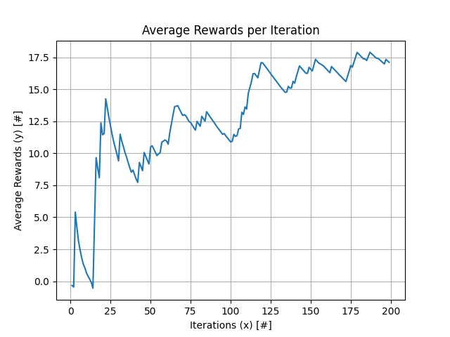
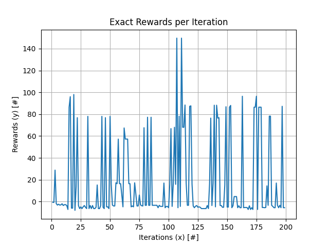

### Link to Github
https://github.com/AmanHogan/Deep-Q-Learning

# **Introduction**
- **State Space:** Since, there are now 10 people max in the simulation the state space has increased, so we need a more coherent way to represent the state space.
- **Online Model and Target** Since we are using DQL, we need a way to setup a DQN for our agent and we need to setup a target dqn.
- **Actions:** Since we are now using neural nets, we need a way to represent actions in a manner where we can learn
- **Environment:** We need to modify our environment to handle 10 people
- **Hyperparameters:** We need to add some new hyperparameters

# Representing our states and actions

Our state space previously, with a sim capacity of 2, was:

```math
((E_{A}, F_{A_i}, D_{A_k}), (E_{B}, F_{B_j}, D_{B_l}), ((F_{Call_m}, F_{Exit_o}, F_{Location_p}), (F_{Call_n}, F_{Exit_p}, F_{Location_r})))
```

which yielded a state space size of: 
```math 
|(1 * 6 *  2)^2 * (7 * 7 * 3)^2| = 3,111,696
```

If we increased the number of people in the simulation to 10, we would have a state space size of:
```math 
|(1 * 6 *  2)^2 * (7 * 7 * 3)^{10}| = 6.784 * 10^{23}
```

As this is wildly infeasible, we are going to implement deep q learning, which requires use to represent the states differently.

Now we can say our states are a vector of size 34 that would look like this in a table format:

|A Floor|A Status|B Floor|B Status|P1| ... |P10|
|---|---|---|---|---|---|---|
|1 | Open |1 | Closed |[1,4,1] | Open |[1,4,0] |

And would look like this as a vector in the code:
[1,1,1,0,1,4,1 ... 1,4,0]

Where the passengers consit of three numbers: (Call, Exit, Location). For location, 0 = Waiting, 1 = Inside A, 2 = Inside B. ANd Open = 1, and Closed = 0.

Next we need to properly represent the states. Since, we cant neccesarily use str format for actions inside the training, we need to one hot encode the,. Since there are 16 actions, here is the one hot encoding of the actions:

```

ACTION_MAPPING = {
    0: ('UP', 'UP'),
    1: ('UP', 'DOWN'),
    2: ('UP', 'HOLD'),
    3: ('UP', 'DOORS'),
    4: ('DOWN', 'UP'),
    5: ('DOWN', 'DOWN'),
    6: ('DOWN', 'HOLD'),
    7: ('DOWN', 'DOORS'),
    8: ('HOLD', 'UP'),
    9: ('HOLD', 'DOWN'),
    10: ('HOLD', 'HOLD'),
    11: ('HOLD', 'DOORS'),
    12: ('DOORS', 'UP'),
    13: ('DOORS', 'DOWN'),
    14: ('DOORS', 'HOLD'),
    15: ('DOORS', 'DOORS')
}
```

Given the proper set up of the states and actions, we can move on to the DQL.


# Deep Q Learning
For our deep q learning, there are three main components that our agent uses: 

- Replay Buffer
- Online model
- Target model

# Replay Buffer
Our replay buffer contains samples from previous training experiences of a set maximum size. Our training samples a set amount of samples form the replay buffer. The best results were obtained with a batch size of 2 and a max buffer size of 100.

# Online Model and Target Model
- First, our agent takes an action according to the policy.
- We take action A, and aboser Reward and add this experience to the replay buffer.
- We then train the model and implement epsilon decay
- During training the model, we get the current q value predictions. We then have the target model predict the q values for the next state and get the td target update for that action. We replace the old q values for that action with the td target. We then compute the gradient step using the fit() method to update the model's weights
- Every 10 steps, we update the target model

# Results

I obtained the best consistent results using the following params:
```
timestep=5, epsilon=1.0, gamma=0.9, alpha=0.1, arrival_rate=0.1, epochs=30, max_steps=5, buffer_capacity=100, batch_size=2, epsilon_decay=0.988, min_epsilon=0.5, verbose=2.0
```

Below it the total average rewards output produced: 


And below is the exact reward produced at each iteration:



